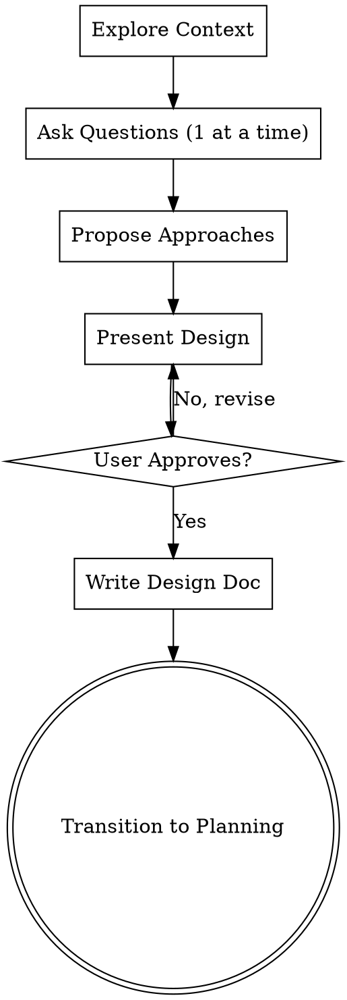

# Advanced Brainstorming Ideas Into Designs

## When to use this skill
- Any new feature request, new component, or structural change.
- The user asks to "brainstorm", "think of ideas", or "figure out how to do this".

## Overview
Turn ideas into fully formed designs and technical specs through natural, collaborative dialogue. Start by understanding the current project context, ask questions to refine the idea, and present the design for user approval.

<HARD-GATE>
Do NOT invoke any implementation tools, write any code, scaffold any project, or take any execution action until you have presented a design and the user has explicitly approved it. This applies to EVERY task regardless of perceived simplicity.
</HARD-GATE>

## Checklist Flow

You MUST complete these items in order:

- [ ] 1. **Explore context**: Read `prd.md`, `findings.md`, and recent code or commits.
- [ ] 2. **Ask clarifying questions**: Ask *one question at a time*. Understand the core constraints and success criteria.
- [ ] 3. **Propose approaches**: Provide 2-3 distinct approaches with trade-offs.
- [ ] 4. **Present design**: Structure the design section by section. Get user approval.
- [ ] 5. **Write design doc**: Save to `plan.md` (or `docs/plans/YYYY-MM-DD-design.md`).
- [ ] 6. **Transition**: Invoke the `advanced-planning` skill.

## Process Flow

## Guiding Principles
- **One question at a time**: Do not overwhelm the user with a giant wall of questions.
- **Multiple choice preferred**: Suggest potential answers whenever possible to make answering easy.
- **YAGNI ruthlessly**: Remove unnecessary features from all designs.
- **Incremental validation**: Present the design, ask if it looks right, then proceed.
