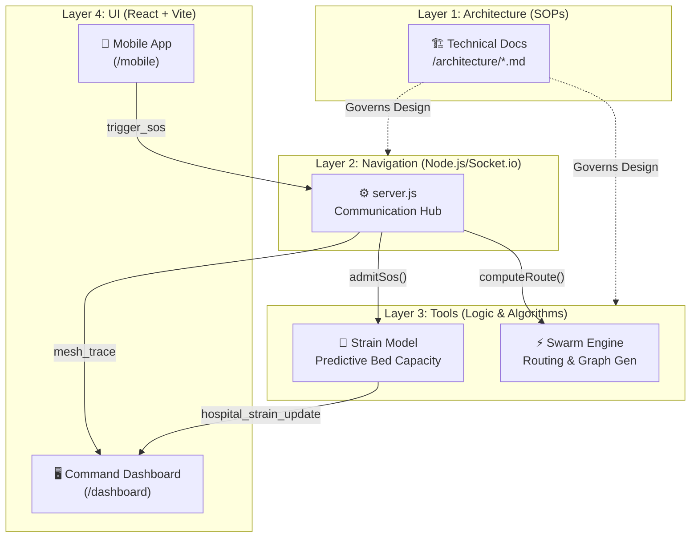

# ⬡ MeshGuard
> **"When the towers fall, the people become the network."**

MeshGuard is a proof-of-concept application built for the **V-HACK 2026 Hackathon**. It tackles the "First Responder of the Future" challenge by demonstrating a **Decentralized Swarm Intelligence Network**.

In disaster scenarios where traditional communication infrastructure (cell towers, Wi-Fi) is destroyed, MeshGuard enables citizen smartphones to form resilient peer-to-peer mesh networks. Citizens can broadcast SOS signals that actively hop from device to device until they reach a First Responder base.

---

## 🏗️ System Architecture (A.N.T. Framework)

MeshGuard follows the **A.N.T. 4-Layer Architecture** (Architecture, Navigation, Tools, UI), ensuring a clear separation of concerns between decentralized logic and real-time visualization.



### The 4 Layers of MeshGuard:

1.  **Layer 1 — Architecture (`architecture/`)**: The Technical SOPs. Every major system (Swarm, Sockets, Frontend) is documented here before implementation to maintain protocol integrity.
2.  **Layer 2 — Navigation (`server.js`)**: The "Air Traffic Control". It manages Socket.io connections, receives SOS signals, and coordinates the response by delegating work to Layer 3 tools.
3.  **Layer 3 — Tools (`src/`)**: Atomic, deterministic algorithms.
    *   **Swarm Engine**: Simulates the **Greedy Gossip-Forwarding** protocol across 150 virtual nodes.
    *   **Predictive Strain Model**: Uses an **Exponential Decay Algorithm** to calculate real-time hospital occupancy based on official **KKMNow/OpenDOSM** data.
4.  **Layer 4 — UI (`frontend/`)**: High-performance React interfaces.
    *   **Tactical Mobile App**: Focused, high-contrast UI for field stress.
    *   **Command Dashboard**: Cartographic visualization of swarm traces and live hospital bottlenecks.

---

## 🚀 Setup & Installation

You will need two separate terminal windows to run both the backend and frontend simultaneously. Run these commands from the **project root folder**.


**Prerequisites:** 
- Node.js (v18+ recommended)
- A laptop (Command Center) and a smartphone (Citizen Device) on the **same Wi-Fi network / Personal Hotspot**.

### 1. Start the Backend Brain (Terminal 1)
```bash
# Start the Node server using our shortcut
npm run app
```
*Expected output:* `🌐 MeshGuard Backend running on http://localhost:3001` and `📡 150 virtual citizen nodes active in swarm matrix`

### 2. Start the Frontend UI (Terminal 2)
```bash
# Start the Vite development server exposed to your local network
npm run dev:frontend
```
*Expected output:* Note the `Network:` IP address (e.g., `http://172.20.10.3:4000/mobile`). Can be used in any broser but preferbly mobile device since ui is made for mobile device (ensure devices are in the same Wi-Fi network / Personal Hotspot).

---

## 📱 Running the Live Demo (The Pitch)

This is the exact sequence to demonstrate the swarm routing "Wow" factor:

### Step A: Prepare the "Command Center" (Laptop Screen)
1. Go to `http://localhost:4000/dashboard`
2. *You should see a dark map filled with blue citizen nodes.*

### Step B: Prepare the "Citizen Device" (Your Smartphone)
1. Ensure your smartphone is connected to the same network as the laptop.
2. Open your mobile browser (Safari/Chrome).
3. Type the **Network IP address** followed by `:4000/mobile`.
   - *Example:* `http://172.20.10.3:4000/mobile`
4. *You should see the tactical Emergency Broadcast UI.*

### Step C: Execute the Swarm Protocol (Live Demo)
1. Tap the emergency type (e.g., 🔥 FIRE).
2. Tap the pulsing red **SOS Broadcast** button.
3. **The Effect:** A red sonar ring will ping the map, and a cyan line will visually "hop" through the swarm, dynamically rerouting to the best hospital based on **live strain data**.

---

## 📚 Deep Dives & Support Files

| Document | Purpose |
|---|---|
| [techstack.md](./techstack.md) | Technical architecture, data sources (KKMNow/OpenDOSM), and future roadmap. |
| [demo_guideline.md](./demo_guideline.md) | Step-by-step video submission guideline and key demo sequences. |
| [architecture.md](./architecture.md) | Full system design and socket event contracts. |

---

- **Frontend:** React 19, Vite, Tailwind CSS, React-Leaflet (CartoDB DarkMatter)
- **Backend:** Node.js, Express
- **Data Source:** **KKMNow / OpenDOSM** — Official Malaysian public health data
- **Real-Time Integration:** Socket.io
- **Routing Engine:** Greedy Gossip-Forwarding protocol simulation
- **Intelligence:** Predictive Strain Model (Exponential Decay Algorithm)
